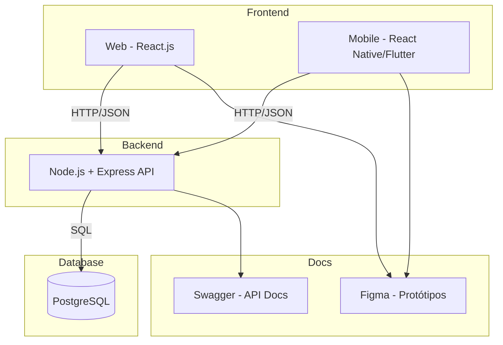

# 🏗 Arquitetura do Sistema – Conecta Doações

## 📌 Visão Geral
O sistema **Conecta Doações** será uma plataforma multiplataforma composta por frontend web/mobile, backend de serviços, APIs REST e banco de dados relacional.  
O objetivo da arquitetura é garantir escalabilidade, segurança, usabilidade e integração com ferramentas de prototipação e documentação.

---

## 🔹 Camadas da Arquitetura

1. **Frontend (Web e Mobile)**
   - Tecnologias: React.js (Web), React Native ou Flutter (Mobile).
   - Função: Interfaces para cadastro de usuários, itens, solicitações e interações.
   - Comunicação com o backend via APIs REST (HTTPS/JSON).

2. **Backend (API/Serviços)**
   - Tecnologias: Node.js + Express.
   - Função: Processar regras de negócio (ex.: registro de doações, trocas, solicitações).
   - Responsável por autenticação, autorização e integração com banco de dados.

3. **Banco de Dados**
   - Tecnologia: PostgreSQL.
   - Função: Armazenar usuários, itens, categorias, pontos de apoio, transações, mensagens e avaliações.
   - Modelo relacional com chaves primárias/estrangeiras (detalhado em `docs/database/database_model.md`).

4. **APIs REST**
   - Protocolo: HTTPS + JSON.
   - Documentação via Swagger.
   - Endpoints para:
     - Usuários
     - Itens
     - Transações
     - Mensagens
     - Avaliações
     - Solicitações

---

## 🔹 Padrões Arquiteturais
- **MVC (Model-View-Controller):** separação entre apresentação, lógica e dados.  
- **RESTful APIs:** comunicação entre frontend e backend.  
- **Autenticação JWT:** para login seguro dos usuários.  
- **Arquitetura em Camadas:** cada camada com responsabilidades bem definidas.  

---

## 🔹 Decisões Técnicas
- **Node.js + Express** → leve, escalável, popular e com boa integração a bancos de dados.  
- **React.js / React Native / Flutter** → multiplataforma, garantindo experiência fluida no web e mobile.  
- **PostgreSQL** → banco robusto e confiável para dados relacionais.  
- **Swagger** → documentação padronizada das APIs.  
- **Figma** → prototipação de interfaces.  

---

## 🔹 Diagrama da Arquitetura (detalhado)

---

## 🔹 Segurança
- Autenticação via JWT.  
- Criptografia de senhas com hash seguro (ex.: bcrypt).  
- Controle de acessos por perfil (usuário comum, administrador, ponto de apoio).  

---

## 🔹 Futuras Extensões
- Integração com sistemas de geolocalização para localizar pontos de apoio.  
- Notificações push em dispositivos móveis.  
- Sistema de gamificação para incentivar doações.  

---

