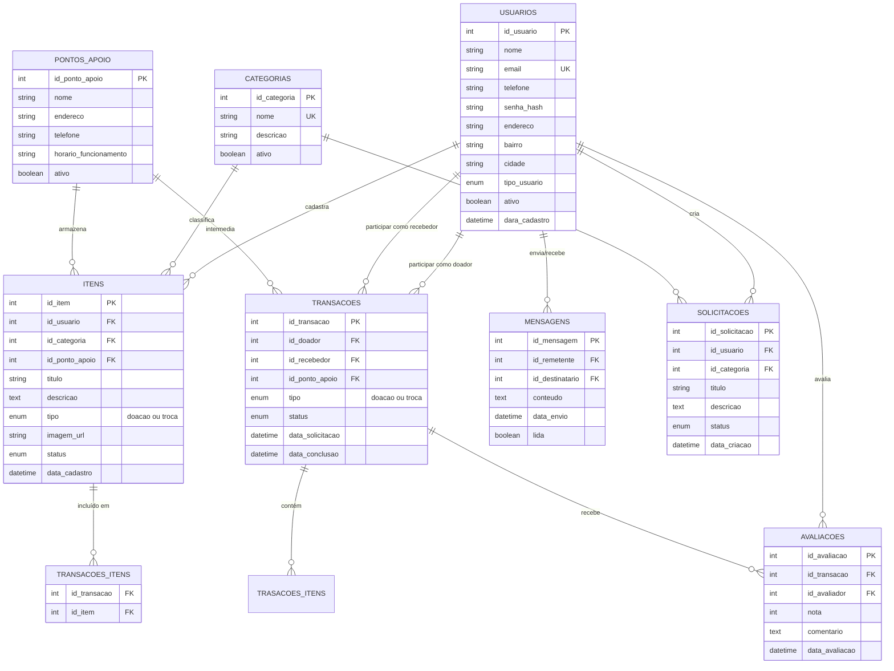

# Modelo de Banco de Dados - Sistemas Conecta Doações

## 01. Visão Geral

O Banco de Dados do sistema Conecta Doações foi projetado para suportar uma plataforma de doações e trocas comunitárias, facilitando a conexão entre doadores e recebedores na Região Metropolitana de Fortaleza. A estrutura permite o gerenciamento de usuários, itens para doação/troca, pontos de apoio e todo fluxo de transações entre os participantes.

## 02. Modelo Conceitual

## 2.1 Principais Entidades

O sistema é composto pelas seguintes entidades principais:

- **Usuarios**: Pessoas cadastradas na plataforma (doadores e recebedores)
- **Itens**: Produtos disponíveis para doação ou troca
- **Categorias**: Classificação dos itens por tipo
- **Transações**: Registro das doações e trocas realizadas
- **PontosdeApoio**: Locais parceiros para armazenamento e retirada
- **Mensagens**: Comunicação entre usuários
- **Avaliações**: Feedback sobre transações realizadas
- **Solicitações**: Pedidos especificos de itens necessários

## 2.2 Relacionamentos Principais

- Um usuário pode cadastrar multiplos itens
- Um item pertence a uma categoria
- Uma transação envolve um doador, um recebedor e um ou mais itens
- Um ponto de apoio pode intermediar múltiplas transações
- Usuários podem trocar mensagens entre si
- Transações podem receber avaliações dos participantes
- Um usuário pode criar múltiplas solicitações

## 03. Diagrama Entidade-Relacionamento (ER)

## 04. Descrição Detalhada das Entidades

## 4.1 Usuarios
- Armazena doadores e recebedores.
- Informações básicas para identificação e contato

## 4.2 Categorias
- Organiza itens (roupas, móveis, eletrônicos, alimentos)
- Facilita busca coforme avaliado positivamente pelos usuários

## 4.3 Itens
- Produtos disponíveis para doação ou troca
- Vinculados a usuários doadores

## 4.4 Transacoes
- Controla o processo de doação/troca
- Conecta doadores e recebedores

## 4.5 Pontos Apoio
- Locais intermediários para facilitar logística
- Parceiros da plataforma

## 05. Dicionario de Dados

## Tabela: Usuarios
| Campo | Tipo | Descrição do Relatório |
|-------|------|------------------------|
| id_usuario | INT PK | Identificador único |
| nome | VARCHAR(100) | Nome do usuário |
| email | VARCHAR(150) UK | Email para acesso |
| telefone | VARCHAR(15) | Contato |
| senha_hash | VARCHAR(255) | Senha segura |
| endereco | VARCHAR(255) | Localização |
| bairro | VARCHAR(100) | Bairro (importante para comunidade local) |
| cidade | VARCHAR(100) | Default: Fortaleza |
| tipo_usuario | ENUM | 'doador', 'recebedor', 'ambos' |
| ativo | BOOLEAN | Status da conta |
| data_cadastro | DATETIME | Registro temporal |

## Tabela: Categorias
| Campo | Tipo | Descrição do Relatório |
|-------|------|------------------------|
| id_categoria | INT PK | Identificador único |
| nome | VARCHAR(50) | Nome da categoria (ex: Roupas, Móveis) |
| descricao | VARCHAR(200) | Descrição |
| ativo | BOOLEAN | Se está disponível |

## Tabela: Itens
| Campo | Tipo | Descrição do Relatório |
|-------|------|------------------------|
| id_item | INT PK | Identificador único |
| id_usuario | INT FK | Doador do item |
| id_categoria | INT FK | Categoria para busca |
| id_ponto_apoio | INT FK | Onde está armazenado (se aplicável) |
| titulo | VARCHAR(100) | Nome do item |
| descricao | TEXT | Detalhes do item |
| tipo | ENUM | 'doacao', 'troca', 'ambos' |
| imagem | VARCHAR(255) | Foto do item |
| status | ENUM | 'disponivel', 'reservado', 'doado' |
| data_cadastro | DATETIME | Quando foi cadastrado |

## Tabela: Transações
| Campo | Tipo | Descrição do Relatório |
|-------|------|------------------------|
| id_transacao | INT PK | Identificador único |
| id_doador | INT FK | Usuário que doa |
| id_recebedor | INT FK | Usuário que recebe |
| id_ponto_apoio | INT FK | Local de intermediação |
| tipo | ENUM | 'doacao' ou 'troca' |
| status | ENUM | 'pendente', 'confirmada', 'concluida' |
| data_solicitacao | DATETIME | Início |
| data_conclusao | DATETIME | Fim |

Tabela: Transacao_Itens
| Campo | Tipo | Descrição |
|---|---|---|
| id_transacao | INT FK | Chave estrangeira que referencia a transação |
| id_item | INT FK | Chave estrangeira que referencia o item |

## Tabela: Pontos_Apoio
| Campo | Tipo | Descrição do Relatório |
|-------|------|------------------------|
| id_ponto_apoio | INT PK | Identificador único |
| nome | VARCHAR(100) | Nome do local parceiro |
| endereco | VARCHAR(255) | Localização |
| telefone | VARCHAR(15) | Contato |
| horario_funcionamento | VARCHAR(200) | Quando está aberto |
| ativo | BOOLEAN | Se está ativo |

Tabela: Mensagens
| Campo | Tipo | Descrição |
|---|---|---|
| id_mensagem | INT PK | Identificador único da mensagem |
| id_remetente | INT FK | Usuário que enviou a mensagem |
| id_destinatario | INT FK | Usuário que recebeu a mensagem |
| conteudo | TEXT | Conteúdo da mensagem |
| data_envio | DATETIME | Data e hora do envio |
| lida | BOOLEAN | Status de leitura da mensagem |

Tabela: Avaliações
| Campo | Tipo | Descrição |
|---|---|---|
| id_avaliacao | INT PK | Identificador único da avaliação |
| id_transacao | INT FK | Transação que está sendo avaliada |
| id_avaliador | INT FK | Usuário que realizou a avaliação |
| nota | INT | Nota da avaliação (ex: de 1 a 5) |
| comentario | TEXT | Comentário opcional sobre a transação |
| data_avaliacao| DATETIME | Data em que a avaliação foi feita |

Tabela: Solicitações
| Campo | Tipo | Descrição |
|---|---|---|
| id_solicitacao | INT PK | Identificador único da solicitação |
| id_usuario | INT FK | Usuário que criou a solicitação |
| id_categoria | INT FK | Categoria do item solicitado |
| titulo | VARCHAR(150) | Título do item ou necessidade solicitada |
| descricao | TEXT | Descrição detalhada da necessidade |
| status | ENUM('ativa', 'atendida', 'expirada') | Status da solicitação |
| data_criacao | DATETIME | Data de criação da solicitação |
